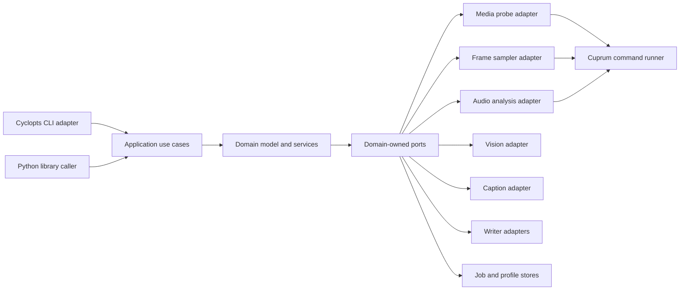
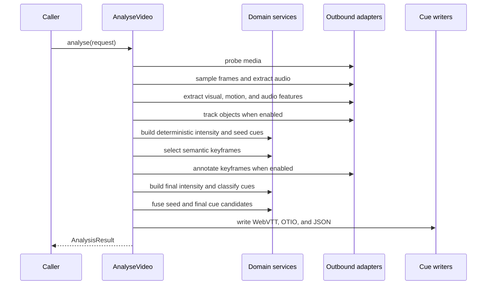

# BeatCue technical design

- Status: Draft
- Audience: Developers implementing BeatCue and reviewers evaluating the design
- Date: 2026-05-09

## 1. Context

BeatCue is a Python package and command-line interface (CLI) for extracting
editorial timing cues from video files. It identifies cuts, transitions, audio
beats, ease-in and ease-out ramps, rising and falling audiovisual intensity,
action peaks, object entries and exits, and selected semantic annotations.

The package emits machine-readable cue sheets, not creative judgement. The
domain model treats "rising action" and "falling action" as measured changes in
audiovisual intensity. Narrative interpretation is optional annotation with
lower confidence unless a trained evaluator validates it.

BeatCue uses WebVTT metadata cues for time-aligned machine-readable playback
metadata because WebVTT text tracks support timed cues and generic metadata
aligned with audio or video.[^1] It uses OpenTimelineIO (OTIO) for editorial
interchange because OTIO defines an API and interchange format for editorial
cut information.[^2] It stores full diagnostic output in BeatCue JSON because
WebVTT and OTIO intentionally omit some internal feature-series detail.

The design uses hexagonal architecture. The domain owns cue entities,
classification rules, and port protocols. Adapters own FFmpeg, computer vision,
audio analysis, model inference, file writing, CLI rendering, and subprocess
execution.

## 2. Goals

- Provide a Python library API that can be used without importing CLI,
  rendering, or filesystem adapters.
- Provide an agent-native CLI with non-interactive defaults, uniform `--json`,
  bounded output, structured errors, `agent-context`, profiles, job recovery,
  and explicit delivery targets.
- Generate WebVTT metadata cues, OTIO markers, and BeatCue JSON from one
  canonical in-memory analysis result.
- Use Cyclopts for the CLI specification and tiered configuration binding.
- Use Rich only for human terminal output. JSON, WebVTT, OTIO, and LLM-facing
  payloads must remain clean ASCII unless a source annotation contains
  non-ASCII text and the selected writer explicitly permits it.
- Use Cuprum for every external command invocation, including `ffprobe`,
  `ffmpeg`, and optional helper tools.
- Use CmdMox to mock external commands in subprocess-oriented tests.
- Enforce dependency injection and prohibit adapter imports from domain code.
- Use pytest, pytest-bdd, syrupy, and Hypothesis for implementation
  verification.

## 3. Non-goals

- BeatCue does not replace a video editor or non-linear editing (NLE) system.
- BeatCue does not make final narrative claims without model provenance and
  confidence.
- BeatCue does not require a diffusion model for tagging. Vision-language
  models (VLMs), object detectors, optical flow, and audio feature extraction
  are the default tools.
- BeatCue does not parse FFmpeg stderr to discover media metadata. The
  subprocess adapter calls `ffprobe` with JSON output.
- BeatCue does not let CLI formatting pollute machine output. Human rendering
  and data serialization are separate adapters.

### 3.1. V1 boundary

BeatCue v1 is a deterministic cue-extraction package for single-scene or
single-shot videos. It is useful when a user needs explainable timing cues from
colour, motion, audio, and scene-change signals without depending on model
captioning or object tracking. This boundary addresses the Logisphere
scope-to-team finding in `docs/beatcue-logisphere-design-stage-review.md` §7
finding 2 and keeps the 80/20 product from §7 finding 13 useful before
enrichment work begins.

V1 includes:

- immutable domain values and a canonical `AnalysisResult`;
- BeatCue JSON and WebVTT output;
- deterministic cue extraction for cuts, fades, beats, ease curves, rising and
  falling audiovisual intensity, and action peaks;
- `inspect`, deterministic `analyse`, `agent-context`, profiles, structured
  diagnostics, and bounded agent-native CLI output;
- local subprocess execution through the Cuprum command catalogue.

Post-v1 work includes semantic annotation, object tracking, object entry and
exit cues, OTIO enrichment, remote model execution, GPU scheduling, advanced
video segmentation, and trainable genre profiles. These features remain behind
ports in the design, but they are not required for the first credible release
unless a later architectural decision record (ADR) changes the boundary.

## 4. Terminology

| Term                | Definition                                                                                                   |
| ------------------- | ------------------------------------------------------------------------------------------------------------ |
| Analysis result     | The canonical in-memory result containing media metadata, feature series, cues, diagnostics, and provenance. |
| Cue                 | A time-bounded event or interval emitted to WebVTT, OTIO, and BeatCue JSON.                                  |
| Colourgram          | A stacked time-series of colour, luminance, saturation, contrast, edge, and adjacent-frame deltas.           |
| Ease-in             | An interval where motion or action intensity follows a rising non-linear curve.                              |
| Ease-out            | An interval where motion or action intensity follows a falling non-linear curve.                             |
| Rising action       | A measured increase in audiovisual intensity over a minimum duration.                                        |
| Falling action      | A measured decrease in audiovisual intensity over a minimum duration.                                        |
| Semantic annotation | A caption or structured VLM response attached to an existing cue or keyframe.                                |
| Port                | A domain-owned protocol that describes a dependency or use case boundary.                                    |
| Adapter             | Infrastructure code that implements a port or drives the application.                                        |

_Table 1: BeatCue terminology._

## 5. Architecture

BeatCue follows a hexagonal pipeline architecture. The application layer
coordinates the analysis use case. The domain layer defines time ranges,
feature series, cues, confidence rules, fusion rules, and port protocols.
Adapters implement video probing, frame sampling, audio extraction, computer
vision, captioning, object tracking, output writing, CLI rendering, profile
storage, job storage, and subprocess execution.

For screen readers: The diagram shows BeatCue's inward dependency direction.
Inbound adapters call application services. Application services depend on
domain ports. Outbound adapters implement those ports.



_Figure 1: BeatCue hexagonal dependency direction._

The dependency rule is strict:

- `beatcue.domain` imports only the Python standard library and other domain
  modules.
- `beatcue.application` imports domain modules and domain-owned port protocols.
- `beatcue.adapters` imports infrastructure packages and implements ports.
- `beatcue.cli` imports application services and the composition root.
- `beatcue.config` is the composition root and constructs concrete adapters.

The import boundary is a CI fitness function. A future implementation must add
an import-lint rule or equivalent static check that fails if domain code
imports from adapters, Cyclopts, Rich, OpenCV, librosa, Transformers, Cuprum,
or CmdMox.

## 6. Package structure

The package layout groups by feature while preserving the hexagonal boundary:

```plaintext
beatcue/
  domain/
    cues.py
    features.py
    media.py
    ports.py
    profiles.py
    services/
      action.py
      ease.py
      fusion.py
      keyframes.py
  application/
    analyse.py
    agent_context.py
    jobs.py
    profiles.py
  adapters/
    inbound/
      cli.py
      library.py
    outbound/
      audio_librosa.py
      captions_transformers.py
      commands_cuprum.py
      frames_opencv.py
      jobs_jsonl.py
      objects_florence2.py
      profiles_toml.py
      scenes_pyscenedetect.py
      writers_json.py
      writers_otio.py
      writers_webvtt.py
  config/
    cli_config.py
    compose.py
```

## 7. Domain model

The domain model is serializable without importing Pydantic, NumPy, OpenCV, or
Transformers. Adapters may use those libraries internally, but they convert
their outputs to domain-owned value objects before returning to the application
layer.

```python
from __future__ import annotations

import dataclasses as dc
import enum
import typing as typ


class CueKind(enum.StrEnum):
    CUT = "cut"
    TRANSITION = "transition"
    BEAT = "beat"
    EASE_IN = "ease_in"
    EASE_OUT = "ease_out"
    RISING_ACTION = "rising_action"
    FALLING_ACTION = "falling_action"
    ACTION_PEAK = "action_peak"
    ENTRY = "entry"
    EXIT = "exit"
    CAPTION = "caption"


@dc.dataclass(frozen=True, slots=True)
class TimeRange:
    start_seconds: float
    end_seconds: float


@dc.dataclass(frozen=True, slots=True)
class ObjectObservation:
    track_id: str
    label: str
    confidence: float
    bbox_xyxy: tuple[float, float, float, float]
    centroid_xy: tuple[float, float]
    velocity_px_s: tuple[float, float] | None
    entry_side: str
    exit_side: str


@dc.dataclass(frozen=True, slots=True)
class Cue:
    id: str
    kind: CueKind
    time: TimeRange
    label: str
    confidence: float
    annotation: str | None
    features: dict[str, float]
    objects: tuple[ObjectObservation, ...]
    provenance: dict[str, typ.Any]


@dc.dataclass(frozen=True, slots=True)
class MediaMetadata:
    source_path: str
    duration_seconds: float
    fps: float
    width: int
    height: int
    has_audio: bool


@dc.dataclass(frozen=True, slots=True)
class Diagnostic:
    code: str
    message: str
    severity: typ.Literal["info", "warning", "error"]
    details: dict[str, typ.Any]


@dc.dataclass(frozen=True, slots=True)
class AnalysisResult:
    media: MediaMetadata
    cues: tuple[Cue, ...]
    diagnostics: tuple[Diagnostic, ...]
    configuration: dict[str, typ.Any]
    provenance: dict[str, typ.Any]
    feature_summaries: dict[str, dict[str, float]]
    feature_series: dict[str, typ.Any] | None
    is_complete: bool
```

`TimeRange` enforces `0 <= start_seconds <= end_seconds`. Cue confidence is a
closed interval from `0.0` to `1.0`. A cue ID is stable for a given input,
configuration, and cue ordering so snapshot tests can compare complete outputs.

`AnalysisResult` is the canonical application return value and the object that
all writers consume. It enforces these invariants:

- `media.duration_seconds` is finite and positive;
- every cue range satisfies
  `0 <= cue.time.start_seconds <= cue.time.end_seconds <= media.duration_seconds`;
- cues are sorted by `(start_seconds, end_seconds, kind, id)`;
- diagnostics are append-only records with stable codes;
- `configuration` is the resolved, secret-free configuration snapshot used for
  the run;
- `provenance` records BeatCue version, adapter names, model names where used,
  source command identities, and prompt/schema versions;
- `feature_summaries` stores bounded aggregate values used to justify cues;
- `feature_series` is absent by default and appears only when
  `include_series` is enabled and the configured series cap is not exceeded;
- `is_complete` is false only when the user opted into partial output after a
  recoverable failure.

BeatCue JSON is the lossless serialization of `AnalysisResult`. WebVTT and OTIO
are projections from it and may omit diagnostic detail that is not native to
those interchange formats.

## 8. Ports and dependency injection

The domain owns these driven ports:

| Port                    | Responsibility                                                       |
| ----------------------- | -------------------------------------------------------------------- |
| `MediaProbe`            | Return duration, streams, frame rate, dimensions, and time base.     |
| `FrameSampler`          | Produce sampled frames and timestamps from a video source.           |
| `AudioExtractor`        | Extract normalized mono audio or report absence of audio.            |
| `AudioFeatureExtractor` | Return RMS, onset strength, tempo, and beat times.                   |
| `SceneDetector`         | Return cut, fade, dissolve, and scene-change candidates.             |
| `MotionExtractor`       | Return optical-flow and frame-difference feature series.             |
| `ObjectTracker`         | Return object tracks, boxes, labels, velocities, entries, and exits. |
| `SemanticAnnotator`     | Return structured keyframe annotations with provenance.              |
| `CueWriter`             | Write an analysis result to one output format.                       |
| `JobLedger`             | Persist submitted and completed CLI jobs.                            |
| `ProfileStore`          | Persist named configuration profiles.                                |
| `CommandRunner`         | Execute approved external commands.                                  |

_Table 2: Domain-owned driven ports._

Application services receive port implementations through constructor
injection. The CLI never instantiates adapters directly; it calls a composition
function that binds configuration to concrete implementations.

```python
@dc.dataclass(frozen=True, slots=True)
class AnalyseVideo:
    media_probe: MediaProbe
    frame_sampler: FrameSampler
    audio_extractor: AudioExtractor
    audio_features: AudioFeatureExtractor
    scene_detector: SceneDetector
    motion_extractor: MotionExtractor
    object_tracker: ObjectTracker
    semantic_annotator: SemanticAnnotator
    cue_writers: tuple[CueWriter, ...]

    def run(self, request: AnalyseRequest) -> AnalysisResult: ...
```

This shape lets tests inject in-memory fakes for domain and application tests.
Adapter tests use CmdMox for external command behaviour and real temporary
files for writer contracts.

## 9. Analysis pipeline

For screen readers: The sequence diagram shows `analyse` probing media,
sampling features, tracking objects, building a deterministic intensity pass,
annotating selected keyframes, building the final intensity pass, fusing
candidates, and writing outputs.



_Figure 2: BeatCue analysis use case._

The application executes these steps:

1. Probe the input with `ffprobe -of json`, through the Cuprum command runner.
   FFprobe documents JSON as an output writer, and JSON output avoids parsing
   diagnostic text.[^3]
2. Sample frames at `sample_fps`, preserving source timestamps.
3. Extract a colourgram from sampled frames.
4. Extract dense optical-flow features from adjacent sampled frames. OpenCV
   documents Farneback optical flow as a dense flow method.[^4]
5. Extract or decode audio and compute RMS, onset strength, tempo, and beat
   times. `librosa.beat.beat_track` estimates tempo and beat events from onset
   strength.[^5]
6. Detect scene candidates with PySceneDetect when enabled. Its
   `AdaptiveDetector` uses a rolling average of frame differences in HSV
   colourspace to reduce false detections during fast motion.[^6]
7. Track objects when `--track-objects` or an object-dependent profile is
   enabled. Object-derived signals are unavailable when tracking is disabled;
   their configured weights are redistributed across available deterministic
   signals instead of being read as zero-valued evidence.
8. Build the first-pass deterministic action-intensity curve from visual,
   motion, audio, cut, and available object signals. This pass excludes
   semantic signals because captions do not exist yet.
9. Fit candidate intervals to ease curves, classify first-pass
   rising/falling-action candidates, and select semantic keyframes at scene
   starts, cuts, first-pass action peaks, object entries/exits, and high
   colour-delta points.
10. Annotate selected keyframes with the configured caption adapter. Qwen2.5-VL
    is a supported video-aware option because its documentation describes
    temporal modelling and dynamic frames-per-second sampling for video
    understanding.[^7] Florence-2 is a supported image-level option because
    Transformers documents captioning, detection, and segmentation tasks for
    it.[^8]
11. Build the final action-intensity curve from visual, motion, audio, cut,
    available object, and validated semantic signals. When no caption model is
    configured, semantic weights are redistributed across available
    deterministic signals.
12. Refit ease curves, classify final rising/falling-action cues and action
    peaks, and fuse first-pass seed candidates with final cue candidates within
    a configurable tolerance.
13. Serialize one canonical analysis result to each requested output.

## 10. Feature extraction

### 10.1. V1 input bounds and memory budget

V1 default support is scoped to single-scene or single-shot videos, not full
films, compilations, or pathological feature-length long takes. The default
profile accepts inputs that satisfy all of these bounds. These bounds address
the memory-exhaustion scenario in
`docs/beatcue-logisphere-design-stage-review.md` §4 scenario B and the input
size findings in §7 findings 5, 6, and 16.

- duration is no more than 600 seconds;
- decoded frame dimensions are no larger than 1920 by 1080;
- `sample_fps` is no more than `4.0`;
- the sampled-frame budget is no more than 2400 frames;
- semantic keyframe selection, for post-v1 semantic runs, is capped at 48
  keyframes unless the user sets a higher explicit limit.

`inspect` reports which bound an input exceeds before `analyse` creates output
files. `analyse` fails early with an actionable error when a default-bound run
would exceed these limits. A user can process larger material only by choosing
an explicit lower sample rate, a future windowed-processing mode, or a profile
that documents its own memory budget.

Feature extraction is incremental. The frame sampler streams one sampled frame
at a time, optical-flow extraction keeps only the previous frame and current
aggregates, and audio features are summarized before cue classification. Full
frame-level feature arrays are not retained unless `--include-series` is set.
Even then, writers must enforce the configured series cap so BeatCue JSON does
not grow without bound.

The colourgram vector for each sampled frame contains:

- HSV histogram bins;
- RGB mean;
- luminance mean;
- saturation mean;
- contrast;
- edge density;
- adjacent colour distance;
- adjacent luminance delta.

Motion extraction returns:

- mean optical-flow magnitude;
- p90 optical-flow magnitude;
- global flow vector;
- camera-motion estimate;
- camera-compensated object speed where tracking is available.

Audio extraction returns:

- RMS energy;
- onset strength;
- estimated tempo;
- beat times;
- no-audio diagnostic when the input lacks an audio stream.

The action-intensity builder normalizes each series with a robust z-score and
computes:

```plaintext
A(t) =
  w_motion * z(motion_energy)
+ w_audio_rms * z(audio_rms)
+ w_onset * z(onset_strength)
+ w_cut_density * z(cut_density)
+ w_colour_delta * z(colour_delta)
+ w_object_entry * z(object_entry_rate)
+ w_semantic * semantic_action_score
```

Profiles define weights and thresholds. The action-intensity builder normalizes
weights over signals that exist for the current run. If `--track-objects` is
disabled, `w_object_entry` is redistributed across deterministic visual,
motion, audio, and cut signals. If no caption model is configured, `w_semantic`
is redistributed the same way. The default profile must set `w_semantic` below
the deterministic signal weights, so captions cannot create a cue without
supporting timing evidence.

## 11. Cue classification

Ease classification fits candidate intervals against canonical curves:

- linear;
- quadratic ease-in;
- quadratic ease-out;
- cubic ease-in;
- cubic ease-out;
- smoothstep;
- smootherstep.

The classifier emits the lowest-error curve when the amplitude, duration,
curvature, and confidence thresholds pass. Otherwise, it emits no ease cue.

Rising and falling action classification operates on the action-intensity
curve. It emits a rising cue when the smoothed slope remains above the
configured positive threshold for at least `min_rising_duration_s`. It emits a
falling cue when the slope remains below the configured negative threshold for
at least `min_falling_duration_s`. The cue stores the slope, amplitude, window
length, and contributing signals in `features`.

Object entry and exit classification requires persistence. A single detection
near a boundary does not create an entry cue. The object tracker must observe a
track for at least `min_track_persistence_s`, and the first or last centroid
must fall inside the configured frame-edge margin.

## 12. Semantic annotation

Semantic annotation is subordinate to timing evidence. The annotator receives
selected keyframes and returns JSON-like records:

```json
{
  "caption": "person enters a bright hallway from the right",
  "visible_actions": ["walking"],
  "objects": ["person", "hallway"],
  "mood": "neutral",
  "action_intensity": 0.35,
  "camera_motion": "static"
}
```

The prompt contract is:

- return structured data only;
- describe visible evidence only;
- do not infer identity;
- do not describe unseen events;
- use ASCII unless the visible text requires otherwise.

The LLM output adapter validates model responses before attaching them to cues.
Invalid JSON, missing required fields, non-finite scores, or unsupported enum
values produce diagnostics and no annotation.

## 13. Output formats

### 13.1. BeatCue JSON

BeatCue JSON is the lossless internal interchange format. It contains media
metadata, feature summaries, cues, diagnostics, configuration, and provenance.
Large frame-level arrays are optional and gated behind `--include-series` to
keep default output bounded.

BeatCue JSON uses `msgspec.Struct` definitions as the v1 schema technology. The
domain model remains expressed as immutable value objects, while the
serialization layer maps those values to typed `msgspec` structures for fast
JSON encoding, decoding, and validation. This choice keeps the schema close to
the Python data model, gives tests a concrete round-trip contract, and avoids
deferring a decision that blocks writer and snapshot work. Replacing `msgspec`
requires an ADR or design update before implementation continues. This resolves
the schema deferral called out in
`docs/beatcue-logisphere-design-stage-review.md` §7 finding 7.

### 13.2. WebVTT

WebVTT output contains metadata cues with compact JSON payloads. The writer
uses ASCII JSON by default with `ensure_ascii=True`. This keeps agent and LLM
consumption stable even when human captions contain Unicode.

```vtt
WEBVTT
NOTE Generated by BeatCue

00:00:03.240 --> 00:00:03.320
{"id":"cue_000001","kind":"cut","label":"Hard cut","confidence":0.93}
```

### 13.3. OTIO

OTIO output stores cues as markers on a clip or timeline. BeatCue writes
`.otio` through the OpenTimelineIO library, not by hand-crafting JSON. The OTIO
file format documentation recommends using the library to read and write OTIO
files rather than implementing a custom parser or writer.[^9]

### 13.4. Human output

Human terminal output uses Rich tables, progress bars, and summaries on
standard error. Data output remains on standard output. `--json` suppresses
Rich renderables and writes structured JSON only. Rich is suitable for this
human adapter because it is a Python library for styled terminal text, tables,
Markdown, and syntax-highlighted output.[^10]

## 14. CLI design

Cyclopts owns the command surface because it builds CLIs from Python type
hints, supports rich type conversion, and generates help from docstrings and
annotations.[^11] BeatCue uses those properties to keep the CLI, configuration
schema, and `agent-context` derived from the same typed command definitions.

The root command is:

```bash
beatcue [GLOBAL OPTIONS] COMMAND [ARGS] [OPTIONS]
```

Global options:

| Option           | Meaning                                                     |
| ---------------- | ----------------------------------------------------------- |
| `--profile NAME` | Load a named profile before environment and explicit flags. |
| `--config PATH`  | Load a TOML configuration file.                             |
| `--json`         | Emit machine-readable JSON to standard output.              |
| `--no-input`     | Reject prompts and fail when required data is missing.      |
| `--plain`        | Disable Rich styling for human output.                      |
| `--verbose`      | Include diagnostics in human output.                        |

_Table 3: Root CLI options._

Commands:

| Command                            | Purpose                                                                            |
| ---------------------------------- | ---------------------------------------------------------------------------------- |
| `analyse VIDEO`                    | Analyse a video and write requested outputs.                                       |
| `inspect VIDEO`                    | Probe media and report streams, duration, and compatibility.                       |
| `agent-context`                    | Emit versioned JSON describing commands, flags, profiles, outputs, and exit codes. |
| `jobs list\|get\|prune`            | Inspect or clean the async job ledger.                                             |
| `profile list\|show\|save\|delete` | Manage named configuration profiles.                                               |
| `feedback add\|list\|send`         | Record CLI friction and optionally send it upstream.                               |

_Table 4: BeatCue CLI commands._

The `analyse` command:

```bash
beatcue analyse input.mp4 \
  --out cues.vtt \
  --json-out cues.json \
  --otio timeline.otio \
  --sample-fps 4 \
  --caption-model Qwen/Qwen2.5-VL-7B-Instruct \
  --detector florence2 \
  --track-objects \
  --wait
```

Agent-native requirements:

- Commands never prompt unless `--interactive` is explicitly set.
- Every data-returning command accepts `--json`.
- Diagnostics and Rich output go to standard error.
- Machine data goes to standard output or explicit output files.
- Destructive commands require `--force`.
- List commands default to bounded `--limit` values and return continuation
  tokens where needed.
- Errors enumerate valid enum values.
- Async submissions accept `--wait` and record state in the job ledger.
- `agent-context` includes `schema_version`, commands, flags, enum values,
  output formats, available profiles, supported delivery schemes, and exit
  codes.

## 15. Configuration

Configuration precedence is:

```plaintext
explicit CLI flag > environment variable > profile > config file > default
```

Cyclopts binds explicit flags to typed command parameters. The composition root
then merges the full configuration stack into immutable request objects.

Default configuration:

```toml
[analysis]
sample_fps = 4.0
min_cue_duration_s = 0.08
merge_tolerance_s = 0.15
include_series = false

[signals.weights]
motion_energy = 0.30
audio_rms = 0.20
onset_strength = 0.15
cut_density = 0.15
colour_delta = 0.10
object_entry_rate = 0.05
semantic_action_score = 0.05

[models]
caption_model = "none"
detector = "none"
track_objects = false

[outputs]
webvtt = true
json = true
otio = false
```

Profiles live under the platform-specific user configuration directory unless
`BEATCUE_HOME` is set. Job ledgers are JSON Lines files with one event per line
so interrupted writes do not corrupt the full ledger.

## 16. Subprocess boundary

The subprocess boundary is one outbound adapter. It uses Cuprum rather than
direct `subprocess` calls. Cuprum provides typed command building, an approved
program catalogue, async execution, synchronous wrappers, graceful
cancellation, and structured command results.[^12]

BeatCue defines a catalogue containing:

- `ffprobe`
- `ffmpeg`
- optional `nixie` for documentation validation
- optional model helper commands only when a plugin requires them.

The command runner records:

- executable identity;
- argument vector;
- working directory;
- environment overlay keys, not secret values;
- timeout;
- exit code;
- captured standard output and standard error when enabled.

The adapter refuses shell strings. Every command is an argument list. Timeouts
are explicit, and cancellation sends a termination request before escalation.

## 17. Testing and verification

The architecture makes testing a design constraint, not an afterthought.

| Surface                   | Verification decision                                                                                                                                 |
| ------------------------- | ----------------------------------------------------------------------------------------------------------------------------------------------------- |
| Domain services           | Use pytest and Hypothesis to prove invariants over generated time ranges, feature arrays, cue windows, and merge tolerances.                          |
| Application orchestration | Use pytest with injected fake ports to verify ordering, failure propagation, and output selection.                                                    |
| CLI behaviour             | Use pytest-bdd scenarios for agent-native behaviours: `--json`, `--wait`, profile precedence, bounded output, and errors that enumerate valid values. |
| Writer contracts          | Use syrupy snapshots for WebVTT, OTIO metadata summaries, BeatCue JSON, `agent-context`, and CLI error payloads.                                      |
| External commands         | Use CmdMox to mock `ffprobe` and `ffmpeg` invocations without running real binaries.                                                                  |
| Adapter smoke tests       | Use small generated media fixtures to verify OpenCV, librosa, PySceneDetect, and writer adapters when dependencies are installed.                     |

_Table 5: Verification responsibilities._

CmdMox is the subprocess test boundary because it intercepts external commands
with Python shims and integrates with pytest.[^13] Tests must not assert
against incidental Rich formatting unless the test belongs to the human
rendering adapter.

Named invariants:

- Time ranges are normalized: `0 <= start_seconds <= end_seconds <= duration`.
- Cue confidence is finite and within `[0.0, 1.0]`.
- Fused cues remain sorted and non-overlapping for the same cue kind when the
  merge tolerance applies.
- WebVTT timestamps round to milliseconds and never move a cue start after its
  end.
- BeatCue JSON round-trips through the canonical schema without losing cue IDs.
- CLI profile precedence is deterministic for every combination of profile,
  environment variable, config file, and explicit flag.
- Semantic annotations cannot create timing cues without a deterministic
  feature candidate.

Hypothesis covers the combinatorial space for configuration precedence, cue
fusion, timestamp conversion, and confidence normalization. Pytest-bdd covers
end-to-end user workflows. Syrupy freezes externally visible outputs, so
reviewers see intentional changes.

## 18. Failure modes

| Failure                              | Behaviour                                                                                                |
| ------------------------------------ | -------------------------------------------------------------------------------------------------------- |
| `ffprobe` is unavailable             | `inspect` and `analyse` fail before side effects with a structured dependency error.                     |
| Input is not a recognized media file | The probe adapter returns a validation error with the failed command result.                             |
| Input has no audio                   | BeatCue emits visual cues and a no-audio diagnostic; audio weights are redistributed.                    |
| Frame sampling fails mid-stream      | `analyse` fails unless `--partial` is set. Partial mode writes diagnostics and marks outputs incomplete. |
| VLM response is invalid              | BeatCue drops the annotation, records the model failure, and keeps deterministic cues.                   |
| Optional model is unavailable        | BeatCue fails only if the user explicitly requested that model.                                          |
| Output path exists                   | Writer refuses to overwrite unless `--force` is set.                                                     |
| `--wait` is interrupted              | The job ledger records the last known state so `jobs get` can recover or report incompleteness.          |

_Table 6: Required failure behaviour._

## 19. Security and privacy

Video frames, audio, captions, and model prompts may contain sensitive content.
This version runs local analysis only. Remote model execution and remote model
adapters are fully out of scope until a future privacy and credentials design
explicitly introduces them.

Security rules:

- Logs never include raw frame payloads, audio payloads, or secret environment
  variable values.
- `agent-context` reports capability and schema information, not local media
  paths from previous jobs.
- Profiles may store model names and default output settings, but not API keys.
- External commands run through the approved Cuprum catalogue.
- Delivery adapters write files atomically and reject unsupported URI schemes.

## 20. Implementation phases

V1 is complete after phases 1 through 4 produce deterministic BeatCue JSON and
WebVTT from real single-scene or single-shot inputs through the library and
CLI. Phase 5 and phase 6 are post-v1 enrichment and extension work.

1. Domain and writers: implement domain value objects, cue fusion, timestamp
   conversion, BeatCue JSON, WebVTT, and writer snapshots.
2. CLI and configuration: implement Cyclopts commands, profile precedence,
   `agent-context`, Rich human output, JSON output, and exit codes.
3. Subprocess and probing: implement Cuprum catalogue, `ffprobe` probing,
   `ffmpeg` audio extraction, and CmdMox tests.
4. Deterministic analysis: implement colourgram, optical flow, librosa audio
   features, PySceneDetect integration, action intensity, ease detection, and
   cue classification.
5. Semantic adapters: implement optional Florence-2 and Qwen2.5-VL adapters
   behind ports, with strict response validation.
6. Job and delivery layer: implement `--wait`, job ledger recovery,
   `--deliver`, and feedback commands.

## 21. Deferred decisions

- The first object tracker is deferred. Florence-2 detection is useful for
  labels and boxes, but persistent tracking may use a simpler centroid tracker
  before SAM 2 or another video segmentation model is introduced.
- Remote model execution and remote adapters are deferred because they require
  a future privacy and credentials design before any implementation can opt in.
- GPU scheduling is deferred. The initial composition root may select CPU-only
  adapters and fail clearly when a requested model requires unavailable
  hardware.

## 22. References

[^1]: MDN Web Docs, "WebVTT API", accessed 2026-05-09,
    <https://developer.mozilla.org/en-US/docs/Web/API/WebVTT_API>.
[^2]: OpenTimelineIO documentation, "Welcome to OpenTimelineIO's
    documentation", accessed 2026-05-09,
    <https://opentimelineio.readthedocs.io/en/latest/index.html>.
[^3]: FFmpeg documentation, "ffprobe Documentation", accessed 2026-05-09,
    <https://ffmpeg.org/ffprobe.html>.
[^4]: OpenCV documentation, "Optical Flow", accessed 2026-05-09,
    <https://docs.opencv.org/4.x/d4/dee/tutorial_optical_flow.html>.
[^5]: librosa documentation, "`librosa.beat.beat_track`", accessed 2026-05-09,
    <https://librosa.org/doc/latest/generated/librosa.beat.beat_track.html>.
[^6]: PySceneDetect documentation, "Detectors", accessed 2026-05-09,
    <https://www.scenedetect.com/docs/latest/api/detectors.html>.
[^7]: Hugging Face Transformers documentation, "Qwen2.5-VL", accessed
    2026-05-09,
    <https://huggingface.co/docs/transformers/model_doc/qwen2_5_vl>.
[^8]: Hugging Face Transformers documentation, "Florence-2", accessed
    2026-05-09,
    <https://huggingface.co/docs/transformers/model_doc/florence2>.
[^9]: OpenTimelineIO documentation, "File Format Specification", accessed
    2026-05-09,
    <https://opentimelineio.readthedocs.io/en/stable/tutorials/otio-file-format-specification.html>.
[^10]: Rich documentation, "Introduction", accessed 2026-05-09,
    <https://rich.readthedocs.io/en/stable/introduction.html>.
[^11]: Cyclopts README, accessed 2026-05-09,
    <https://github.com/BrianPugh/cyclopts>.
[^12]: Cuprum README, accessed 2026-05-09,
    <https://github.com/leynos/cuprum>.
[^13]: CmdMox README, accessed 2026-05-09,
    <https://github.com/leynos/cmd-mox>.
